Chapter 1 within Practical Malware Analysis focuses on basic malware static analysis techniques. Some of the techniques that are covered within this chapter include hashing, antivirus scanning, reviewing strings within the binary, detecting if the program is packed or not, reviewing imports/exports, and examining the various fields within the PE header. I will provide short answers to each question at the beginning and then walk through my methodology and go into more detail.

## Lab 1-1

### Questions

1. Upload the files to http://www.VirusTotal.com/ and view the reports. Does either file match any existing antivirus signatures?
	- Yes. Both files have multiple AV hits on VirusTotal
2. When were these files compiled?
	- **Lab01-01.dll** - 2010-12-19 08:16:38
	- **Lab01-01.exe** - 2010-12-19 08:16:19
3. Are there any indications that either of these files is packed or obfuscated? If so, what are these indicators?
	- No
4. Do any imports hint at what this malware does? If so, which imports are they?
	- The .exe and .dll file suggest that there are functions with backdooring capabilities, networking, and manipulating files on the system.
5. Are there any other files or host-based indicators that you could look for on infected systems?
	- Examine Kerne132.dll
6. What network-based indicators could be used to find this malware on infected machines?
	- IP Address 127.26.152.13
7. What would you guess is the purpose of these files?
	- The .dll file is probably a backdoor of some kind and the .exe file is used to run the .dll

### Initial Triage

Lab 1-1 presents two different files: Lab01-01.exe and Lab01-01.dll. The first thing I want to confirm is if the files are what they say they are. Running `file` against both confirms that both are PE32 executables.
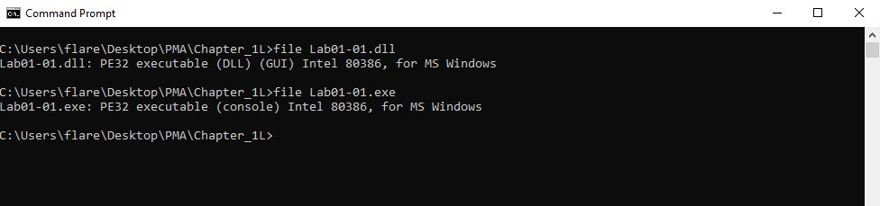

### Hashing and VirusTotal
After confirming the file type, I am going to hash them and then search VirusTotal for both hashes to answer the first question if either file match any existing antivirus signatures.
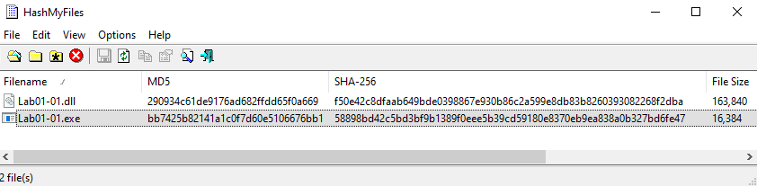
	**Lab01-01.dll** [VirusTotal Report](https://www.virustotal.com/gui/file/f50e42c8dfaab649bde0398867e930b86c2a599e8db83b8260393082268f2dba) 
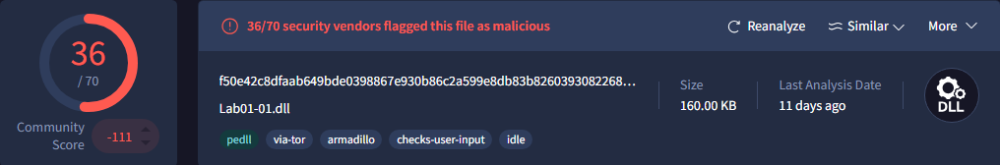
	**Lab01-01.exe** [VirusTotal Report](https://www.virustotal.com/gui/file/58898bd42c5bd3bf9b1389f0eee5b39cd59180e8370eb9ea838a0b327bd6fe47)

### Compilation Time
I will use Detect it Easy (DiE) to view the compilation time of both files. The compilation time will give us an idea of when the executable was created although it can be changed. Due to the compilation time, it is worth noting that both of these files might be related.

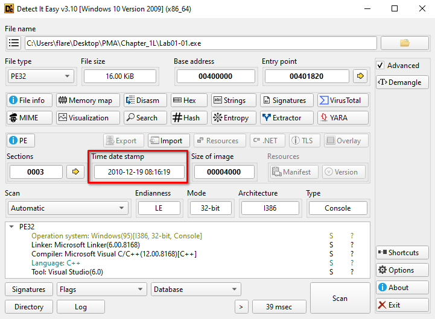

### Packing and Obfuscation
A few different signals point to if a binary is packed or not.  
**Compiler/Linker info:** If DiE identifies a known compiler or linker, the binary is probably not packed.  
**Entropy:** Packed or encrypted data have higher entropy (~>7.0) than normal programs.   
**Virtual Size vs Raw Size:** If a section has a virtual size much larger than its raw size, it is likely that the binary is unpacking itself at runtime.  
**Strings:** Packed binaries tend to show fewer readable strings. An unpacked binary will show more in plain text. The strings output will be further down in the indicators section since it is not needed to show packing and obfuscation in this example.  
Die shows all of this so we can check each indicator without leaving the tool.  

**Lab01-01.dll**
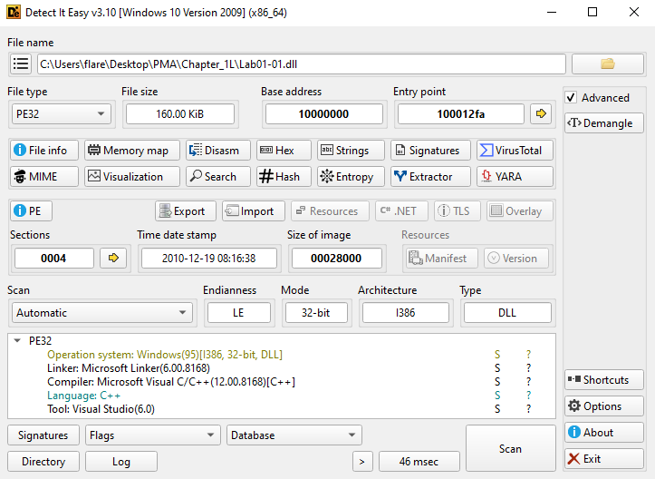
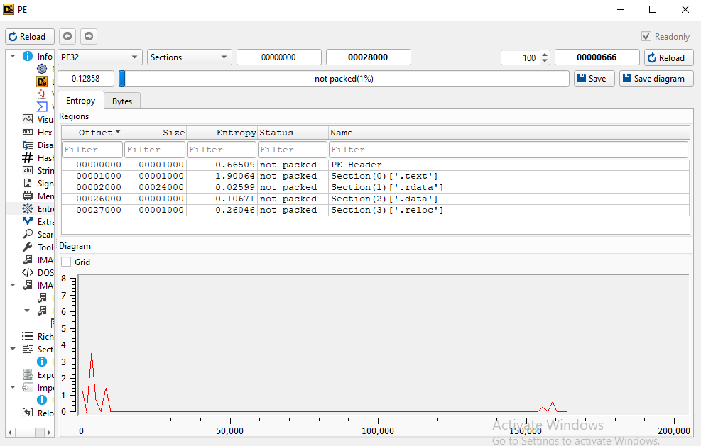

**Lab01-01.exe**
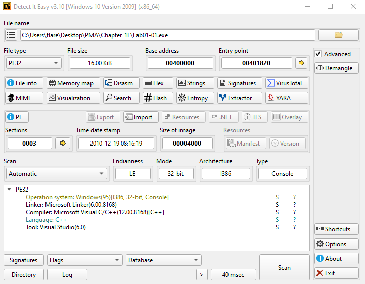
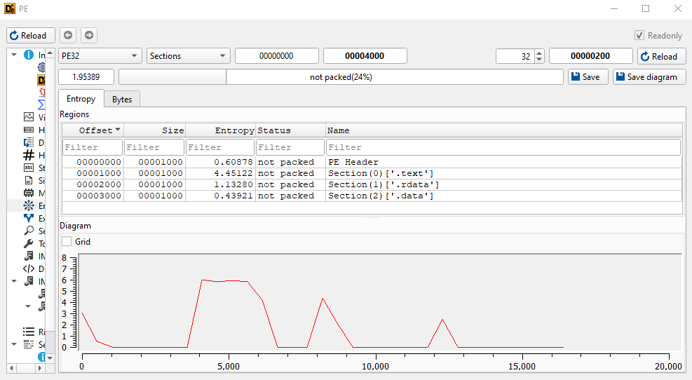

### Import Review
Reviewing the strings data gives an idea of what imports we will see in the files. All of the information can still be found within DiE but I am going to use PE-Bear this time to change it up. 
The Lab01-01.dll file also doesn't have any interesting imports in `MSVCRT.dll`. Within `KERNEL32.dll` there are functions such as `CreateProcess` and `Sleep` that suggest it includes some type of backdoor capability. Also within the `WS2_32.dll`, there are 10 functions that are imported by ordinal. One way to view what these functions would be would be to load the .dll within PE bear and find out what the ordinals map to. In this case, the ordinals map to networking functions.

The Lab01-01.exe file doesn't have any interesting imports in `MSVCRT.dll`, but within `KERNEL32.dll` there are functions for searching, opening and manipulating files. This suggests that the malware searches through the file system and that it can open and manipulate files.

**Lab01-01.dll**
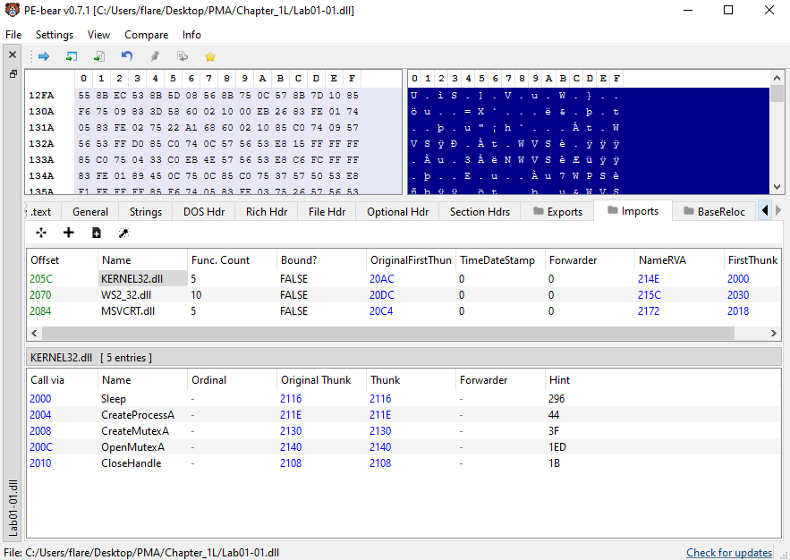
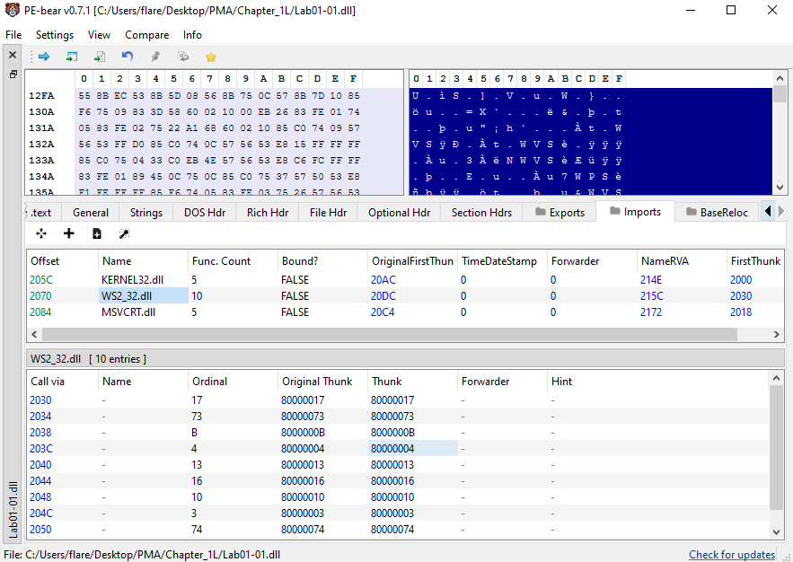
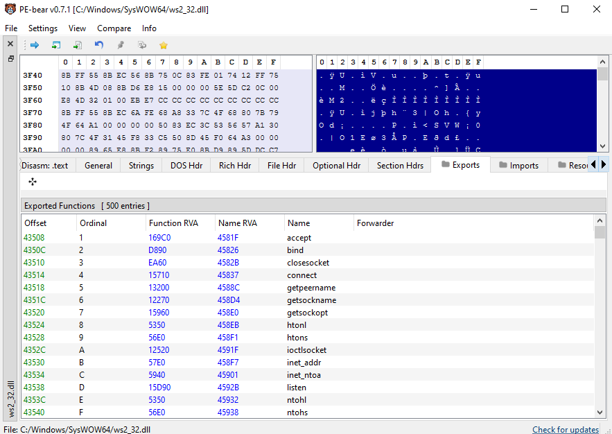

**Lab01-01.exe**
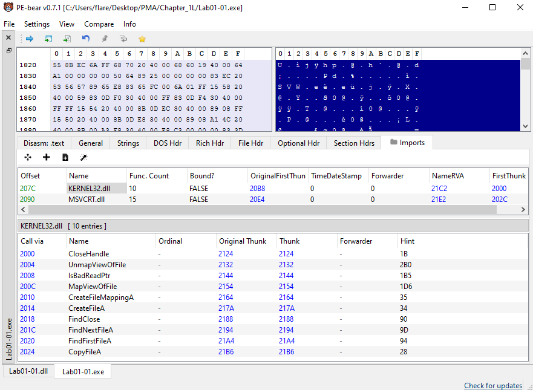

### Indicators
If we review the strings from earlier after reviewing the imports there are a few things that stand out.  
**Lab01-01.dll**
The strings in this dll show an IP Address, as well as `exec` and `sleep` commands. It is likely that the `exec` command is used to run something with `CreateProcess`.
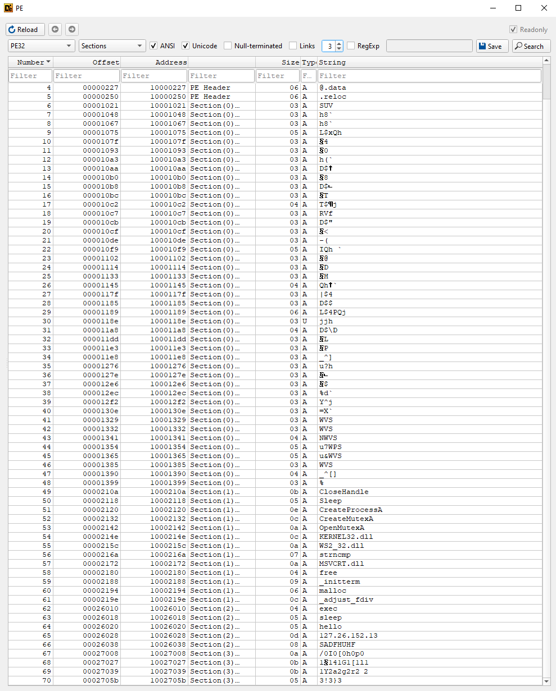  

**Lab01-01.exe**
There is a Kerne132 string that is made to look like Kernel32 as well as a .exe string. If this were going to be analyzed further, the Kerne132.dll file should be analyzed. Based off of the imports from the previous section it seems likely that the program is looking for .exe files on the host.
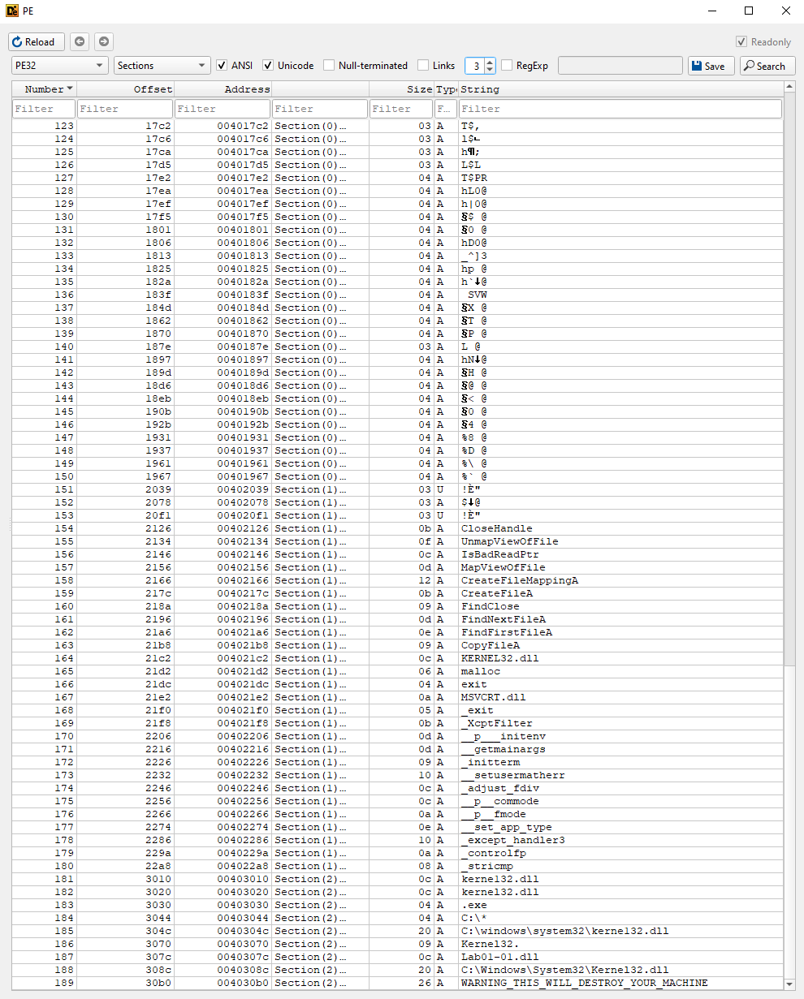 

---

## Lab 1-2
1. Upload the file to VT and view the reports. Does the file match any antivirus signals?
	1. https://www.virustotal.com/gui/file/c876a332d7dd8da331cb8eee7ab7bf32752834d4b2b54eaa362674a2a48f64a6
2. Are there any indications that the file is packed or obfuscated? If it is, unpack it
3. Do any imports hint at the program's functionality?
4. What host or network based indicators could be used to identify this malware on infected machines?

## Lab 1-3
1. Upload the file to VT and view the reports. Does the file match any antivirus signals?
	1. https://www.virustotal.com/gui/file/7983a582939924c70e3da2da80fd3352ebc90de7b8c4c427d484ff4f050f0aec
2. Are there any indications that this file is packed or obfuscated?  If it is, unpack it
3. 3. Do any imports hint at the program's functionality?
4. What host or network based indicators could be used to identify this malware on infected machines?

## Lab 1-4
1. Upload the file to VT and view the reports. Does the file match any antivirus signals?
	1. https://www.virustotal.com/gui/file/0fa1498340fca6c562cfa389ad3e93395f44c72fd128d7ba08579a69aaf3b126
2. Are there any indications that the file is packed or obfuscated? If it is, unpack it
3. When was this program compiled?
4. Do any imports hint at the program's functionality?
5. What host or network based indicators could be used to identify this malware on infected machines?
6. Examine the resource in the resource section, what can we learn from this resource?

7. 
